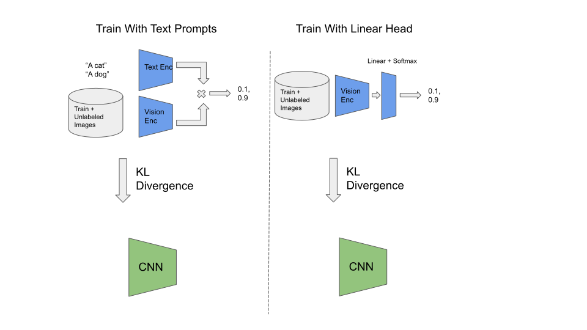

# Jetson Introduction to Knowledge Distillation


This repository contains tutorial that is an introduction to the subject of knowledge distillation,
which can be a helpful tool to use when deploying large models to the edge.

In this tutorial, we explore knowledge distillation by transfering the knowledge
from the OpenCLIP vision-language model into a ResNet18 model for the purpose of classification
on the STL10 dataset.  We'll explore how the data used for distillation, the methods used for distillation, and model architecture impact the final accuracy.  We'll also discuss how you can profile and optimize models for final real-time deployment
on NVIDIA Jetson Orin Nano.

This tutorial can help you learn how to take large existing models, and transfer knoweldge
for use with architectures that are better suited for edge deployment because they have
lower memory consumption, higher throughput, or better architecture support (ie: running on Jetson AGX Orin's Deep Learning Accelerator).

This tutorial is intended to introduce knowledge distillation conceptually, and
help guide you on the process.  We've included the code for reproducing the results,
and we include some inline code for clarity in expressing the concepts.  However,
this tutorial assumes you have some familiarity with training neural networks,
so we won't cover all of the code explicitly in detail.

If you're familiar with deep learning and model training, and are looking for ways
to bring large models to the edge, this tutorial may be a helpful introduction for
you!

Let's get started!

> Check out our other project [clip-distillation](https://github.com/NVIDIA-AI-IOT/clip-distillation) to see how you can use knoweldge distillation to create your own custom image classifier without any labeled data!

## Table of Contents

- [What is knowledge distillation?](#what-is-knowledge-distillation)
- [What is OpenCLIP?](#what-is-openclip)
- [What is the STL10 dataset?](#what-is-the-stl10-dataset)
- [Evaluating OpenCLIP on STL10 for classification](#evaluating-openclip-for-image-classification-on-the-stl10-dataset)
    - [Using Text Prompts](#using-text-prompts-for-classification)
    - [Using Linear Head](#using-linear-head-for-classification)
- [Training a student model to mimic OpenCLIP](#training-a-student-model-to-mimic-openclip)
    - [How does distillation compare to training with ground truth labels?](#how-does-distillation-compare-to-training-with-ground-truth-labels)
    - [How does the data used for distillation impact accuracy?](#how-does-the-data-used-for-distillation-impact-accuracy)
    - [How does the student model architecture impact model accuracy?](#how-does-the-student-model-architecture-impact-model-accuracy)
    - [How does the distillation method impact model accuracy?](#how-does-the-distillation-method-impact-model-accuracy)
- [Optimizing the models with TensorRT and comparing the performance](#optimizing-the-models-with-tensorrt-and-comparing-the-performance)
- [Next Steps](#next-steps)
- [References](#references)

## What is knowledge distillation?

Knowledge distillation is a technique for transferring the knowledge from one 
neural network, the teacher, to another neural network, the student.  

|  |
|:--:|
| Image Credit: [Knowledge Distillation: A Survey](https://arxiv.org/abs/2006.05525) |

This process can take a variety of forms that may be classified as

1. Response Knowledge Distillation:  Training the output class probability distribution to match the teacher probability distribution using a divergence loss (ie: using KL divergence).
2. Feature Knowledge Distillation:  Training the internal features of a student model to directly match the internal features of a teacher model (ie: using Mean Squared Error).
3. Relative Knowledge Distillation:  Training the relative distribution of features in the teacher
model to match the relative distribution of features in the student.

In this tutorial, we'll be exploring (1, 2) given their simplicty compared to relative knowledge distillation
We're particularily interested in exploring how we can use knowledge distillation to take a large transformer based teacher model (OpenCLIP), and train a faster, lower memory model (ResNet18) that is better suited for edge deployment.
We'll explore this concept by aligning OpenCLIP as an image classifier targeting
the STL10 classification dataset.  We'll explore how the data and techniques
used for distillation impact the final model accuracy.

For a more in-depth introduction to knowledge distillation, we recommend reviewing [Knowledge Distillation: A Survey](https://arxiv.org/abs/2006.05525). 


## What is OpenCLIP?

The teacher model we'll be exploring in this tutorial is [OpenCLIP](https://github.com/mlfoundations/open_clip).  In case you're unfamiliar, OpenCLIP is an
open source implementation of OpenAI's CLIP (Contrastive Language-Image Pre-training)
.  CLIP models are trained to match images with text.  To be
specific, the model is comprised of

1. An image encoder, that takes an image and produces an embedding represents the image
2. A text encoder, that takes a text prompt and produces an embedding that represents the text prompt

The model is trained so that the image and text embeddings of paired images and text
are similar (low distance) and the image and text embeddings of non-paired images and
text are very different (high distance). 

|  |
|:--:|
| Image Credit: https://github.com/openai/CLIP |

An interesting aspect of this model is that it's trained on a large amount of unstructured data and has learned features that can transfer to a wide variety
of tasks.  In fact, it can achieve good zero-shot accuracy on classification tasks by simply providing descriptions
of the classes like:

1. "A dog"
2. "A cat"

However, the downside of this model is that it has relatively
high runtime and memory consumption compared to CNN
based architectures like ResNet.  This begs the question: can we leverage
the capabilities of OpenCLIP while obtaining lower memory consumption and latency?  In this tutorial, we'll explore how we can
use the OpenCLIP model as a teacher model, to train a CNN model for a classification
task.  We'll explore how data used for training, methods for aligning the model for the classification task, and methods fo distilling the model impact the final accuracy.

## What is the STL10 Dataset?

To explore how we can use OpenCLIP for classification and knowledge transfer, we'll 
use the STL10 dataset from Stanford.  The STL10 dataset is a classification dataset with 
10 classes:


1. Airplane
2. Bird
3. Car
4. Cat
5. Deer
6. Dog
7. Horse
8. Monkey
9. Ship
10. Truck

|  |
|:--:|
| Image Credit: https://cs.stanford.edu/~acoates/stl10/ |


We chose this dataset over other classification datasets like MNIST and CIFAR10 because:

1. Compared to MNIST, it contains natural images, which are suited towards the use of OpenCLIP. 
2. Compared to CIFAR10, the images are 96x96 resolution, rather than 32x32.  Which
is a closer fit to the training resolution of OpenCLIP.
3. It contains a large number of unlabeled images (100,000), which allows us to explore 
the benefit of using unlabeled data during training.

> As a disclaimer, because this tutorial only explores the STL10 dataset, some results
> may be dependent on this particular data distribution and task.  While we can't
> guarantee the results will translate to other tasks and data sources, we hope
> that you will find this tutorial helpful as an introduction to this subject so
> you can explore knowledge distillation with your own data.


## Evaluating OpenCLIP for image classification on the STL10 dataset

Now that we have an introduction to knowledge distillation, the teacher model
we're using, and the dataset and task we're targeting.  Let's get started!

Before we begin towards using our teacher model to train the student, it's
good to have an initial expectation how well our teacher model will work for the
task at hand.  This can roughly help set expectations for what the best performance
we hope to achieve with our student model is.

Because OpenCLIP isn't directly trained on the STL10 dataset, there are a few
ways we can align this model to perform classification.  Let's explore these.

### Using text prompts for classification

The first, and simplest, way we can use OpenCLIP for classification on the STL10
dataset, is to define the classes using text prompts, run the prompts through
the text encoder, and compare each encoded text prompt with the ground truth label.


For STL10 dataset, we can generate the text embeddings as follows

```python3
import open_clip

model, _, preprocess = open_clip.create_model_and_transforms(
    "ViT-B-32", 
    pretrained="laion2b_s34b_b79k"
)

tokenizer = open_clip.get_tokenizer("ViT-B-32")

labels = [
    "an airplane",
    "a bird",
    "a car",
    "a cat",
    "a deer",
    "a dog",
    "a horse",
    "a monkey",
    "a ship",
    "a truck"
]

text = tokenizer(labels)
text_embeddings = model.encode_text(text)
```

Now, embeddings contains a 512 length vector for each text prompt.  This vector has
the same size as the vision encoder output.  The dot product of the vector with vision
features indicates the similarity, so we can determine the class probabilities
for our dataset as follows

```python3
import torch.nn.functional as F

def embeddings_to_class_probs(vision_embeddings, text_embeddings)
    vision_embeddings = vision_embeddings / vision_embeddings.norm(dim=-1, keepdim=True)
    text_embeddings = text_embeddings / text_embeddings.norm(dim=-1, keepdim=True)
    logits = vision_embeddings @ text_embeddings.T
    class_probs = F.softmax(100. * logits, dim=-1)
    return class_probs
```

Now that we have the text embeddings for our target task, and a method to compare
these against the image embeddings, all that's left to do is run the STL10
dataset through OpenCLIP vision encoder, compute the output class probabilities,
and compare the result against the ground truth label.

```python3
import tqdm
from torchvision.datasets import STL10

dataset = STL10(
    root=dataset_path,
    download=True,
    split="test"
)

num_correct = 0

for image, label in tqdm.tqdm(dataset):
    input_tensor = preprocess(image).unsqueeze(0)
    vision_embeddings = model.encode_image(input_tensor)
    output_class_probs = embeddings_to_class_probs(vision_embeddings, text_embeddings)
    output_label = torch.argmax(dim=-1)
    num_correct += int(torch.count_nonzero(output_label == label))

accuracy = 100. * num_correct / len(dataset)
```

And viola!  Out of the box, the OpenCLIP encoder, without any additional training,
get's **96.68%** accuracy on the STL10 test dataset!  With no tricks, we achieved fairly competitive accuracy on the STL10 dataset, for comparison you can see other
competitive results on the STL10 dataset [here](https://paperswithcode.com/sota/image-classification-on-stl-10)


### Using linear head for classification

As shown, using the text prompts as class labels, we were able to achieve pretty good accuracy on the STL10 dataset without any training or ground truth labels.  But 
what if we have ground truth labels available?  Can we use this to improve the 
accuracy?

With this option, we'll explore how we can use some ground truth data to train
a tiny logistic regression layer (linear layer followed by softmax) at the end
of the OpenCLIP model and see if this improves the accuracy.


To do this, we define our linear layer as follows

```python3
import torch.nn as nn

linear_probe = nn.Linear(512, len(labels))
```

We then need to train our model.  This involves

1. Read a batch from the dataset
2. Run the OpenCLIP vision encoder (no gradients)
3. Run the linear layer on the output of OpenCLIP
4. Compute cross entropy between the linear layer output and ground truth label
5. Update the linear layer

```python3
optimizer = torch.optim.Adam(linear_probe.parameters(), lr=3e-4)

for epoch in range(num_epochs):
    for image, label in iter(train_loader):
        # ... run open-clip to get vision embeddings
        optimizer.zero_grad()
        output_logits = linear_probe(vision_embeddings)
        output_logprob = F.log_softmax(output_logits, dim=-1)
        loss = F.nll_loss(output_logprob, label)
        loss.backward()
        optimizer.step()
```

After training the linear probe, we evaluate it on the STL10 dataset, similar
to before, and our accuracy is now **98.57**!  

Great!  By using some labeled data, we were able to train a small logistic regression layer that improves the accuracy of OpenCLIP on the STL10 dataset by nearly **+2%**!

This improvement is likely because our text prompts, like "an airplane", might
not perfectly match the labels as they appear in the STL10 dataset.  But by
seeing a few examples for each label, we can learn reference embeddings that
more accurately represent the class labels.


## Training a student model to mimic OpenCLIP

We've now seen that using the large OpenCLIP model, we can achieve competetive
results on the STL10 image classification dataset with little effort.  But OpenCLIP is large, and is likely to have high memory consumption and latency compared to other model
architectures.  In addition, as a vision transformer model, OpenCLIP is less capable
of exploiting the Deep Learning Accelerator (DLA) on Jetson AGX Orin, given
the matrix multiplication in the attention layers.  CNN models, like resnet18,
on the other hand are highly optimized by both the GPU and DLA on Jetson, and
allow us to run models at higher throughput and with less memory.

However, knowledge distillation can impact the accuracy of the model, so we'd like
to better understand what factors are most important.  To do this,
we've run a few experiments that seek to answer a few questions:

1. How does distillation compare to training with ground truth labels?
2. How does the data distribution used for training impact model accuracy?
3. How does the distillation method impact model accuracy?  Is it better to train
on the class probabilities or internal features?
4. How does the student model architecture impact model accuracy?  Will resnet50 obtain higher accuracy than resnet18?


### How does distillation compare to training with ground truth labels?

For this set of experiments, we will train resnet18 from scratch, using ground truth
labels, and compare this to training resnet18 on the output probabilities of OpenCLIP
(with text prompt labels, and with the linear regression method).


In each experiment, we use only the STL10 train dataset (5000 images), to provide a fair comparison against the baseline training.

| Experiment Name        | Student Model | Teacher Model | Data Used   | Test Accuracy |
|------------------------|---------------|---------------|-------------|---------------|
| resnet18_from_scratch  | resnet18      | None          | stl10_train | 57.93         |
| resnet18_text_train    | resnet18      | openclip_text | stl10_train | 44.04         |
| resnet18_linear_train  | resnet18      | openclip_linear | stl10_train | 60.65       |

To reproduce these results, you can create a python file and call the folowing.  

```python3
from stl10 import (
    precompute_clip_stl10_train_image_embeddings,
    precompute_clip_stl10_test_image_embeddings,
    precompute_clip_stl10_text_embeddings,
    train_resnet18_from_scratch,
    train_resnet18_zero_shot_train_only,
    train_resnet18_linear_probe_train_only
)

precompute_clip_stl10_train_image_embeddings()
precompute_clip_stl10_test_image_embeddings()
precompute_clip_stl10_text_embeddings()
train_resnet18_from_scratch()
train_resnet18_zero_shot_train_only()
train_resnet18_linear_probe_train_only()
```
As we can see, with equal data used for training, the distilled model using the linear
regression head achieves higher accuracy than using the ground truth labels directly,
even though each method uses the same set of data and labels available.  However,
the text prompt method was unable to reach the accuracy of training resnet18 from scratch.

This shows that knowledge distillation has the capability to improve model accuracy, even under the same data distribution.  However, we'll see in the next section
how we can take this much further, by utilizing *unlabeled* data during the distillation process.  In fact, using unlabeled data, the text prompting method (which doesn't require any ground truth labels in the process) is able to exceed training
the model from scratch by a huge margin!

### How does the data used for distillation impact accuracy?

Now we've seen knowledge distillation has the capability of improving the model accuracy.  But our best student model (**60.65%** accuracy) is still **far** below the accuracy of our teacher model (**98.57%** accuracy).

Why is this?  Does the student model, resnet18, lack the capacity to mimic the teacher model?  Or is it something else, perhaps the data that we used for distillation?  

To help answer this question, we ran a series of experiments that perform knowledge distillation using not only the 5000 images in the STL10 train dataset, but also 100,000 unlabeled images that are provided in a supplementary STL10 dataset.  The results of these experiments are sumarized in the table below



| Experiment Name        | Student Model | Teacher Model | Data Used   | Test Accuracy |
|------------------------|---------------|---------------|-------------|---------------|
| resnet18_text_train_unlabeled    | resnet18      | openclip_text | stl10_train + stl10_unlabeled | 94.32         |
| resnet18_linear_train_unlabeled  | resnet18      | openclip_linear | stl10_train + stl10_unlabeled | 96.88 |

To reproduce these results, call the following in Python

```python3
from stl10 import (
    precompute_clip_stl10_train_image_embeddings,
    precompute_clip_stl10_unlabeled_image_embeddings,
    precompute_clip_stl10_test_image_embeddings,
    precompute_clip_stl10_text_embeddings,
    train_resnet18_zero_shot,
    train_resnet18_linear_probe
)

precompute_clip_stl10_train_image_embeddings()
precompute_clip_stl10_unlabeled_image_embeddings()
precompute_clip_stl10_test_image_embeddings()
precompute_clip_stl10_text_embeddings()
train_resnet18_zero_shot()
train_resnet18_linear_probe()
```

Wow!  Simply by including a large number of unlabeled images from the STL10 unlabeled datasetsplit during the distillation process, the accuracy of the model improved substantially!  Now, the resnet18 model with text-prompt labels **far** exceeds the accuracy of the resnet18 trained with ground-truth labels, and falls just ~2% below
the original OpenCLIP model with text-prompt labels.  The distilled model with linear classification head goes even further, at 96.88%,  exceeding the original OpenCLIP model with text prompting, and falling less than 2% below our best OpenCLIP varianet with a linear classification head.  

So in summary,

1. With *no labels*, just a large amount of unlabeled data we can achieve 94.32% accuracy with a resnet18 model by distilling a text-prompt OpenCLIP classifier
2. With *some labels* and a large amount of unlabeled data we can achieve 96.88% accuracy with a resnet18 model by distilling a OpenCLIP classifier with linear classification head

The lesson learned is that the data used for distillation is very important for
obtaining good accuracy.

But what about our student model architecture?  Could we achieve better results 
using a higher capacity model like resnet50?


### How does the student model architecture impact model accuracy?

To explore the impact of the student model architecture on final model accuracy,
we ran a series of experiments where we used our best distillation configuration,
with three different model architectures; resnet18, resnet34, resnet50.  The results
of these experiments are summarized below


| Experiment Name        | Student Model | Teacher Model | Data Used   | Test Accuracy |
|------------------------|---------------|---------------|-------------|---------------|
| resnet18_linear_train_unlabeled    | resnet18      | openclip_linear | stl10_train + stl10_unlabeled | 96.88         |
| resnet34_linear_train_unlabeled  | resnet34      | openclip_linear | stl10_train + stl10_unlabeled | 96.69 |
| resnet50_linear_train_unlabeled  | resnet50      | openclip_linear | stl10_train + stl10_unlabeled | 96.76 |

To reproduce these results, call the following in Python

```python3
from stl10 import (
    precompute_clip_stl10_train_image_embeddings,
    precompute_clip_stl10_unlabeled_image_embeddings,
    precompute_clip_stl10_test_image_embeddings,
    precompute_clip_stl10_text_embeddings,
    train_resnet18_linear_probe,
    train_resnet34_linear_probe,
    train_resnet50_linear_probe
)

precompute_clip_stl10_train_image_embeddings()
precompute_clip_stl10_unlabeled_image_embeddings()
precompute_clip_stl10_test_image_embeddings()
precompute_clip_stl10_text_embeddings()
train_resnet18_linear_probe()
train_resnet34_linear_probe()
train_resnet50_linear_probe()
```

As seen above, we saw a relatively negligable difference when switching between student model architectures.  This means, at least for this task (STL10 classification),
the data used for distillation was much more important than the student model architecture.  

It's quite possible that for other tasks, this may not be the case, but we wanted to include these results to share this finding at least in this scenario, so you
can understand and prioritize which factors to explore first.

While for STL10 we didn't see a substantial change by switching model architectures, 
there is still one question we wanted to explore for this tutorial.  That is,
how does the distillation method impact model accuracy?


### How does the distillation method impact model accuracy?

So far we've seen that the data used for training has a large impact on model accuracy,
but what about the method used for distillation?  As mentioned previously,
knowledge distillation can be performed in a few ways

1. Response distillation (done above):  Fit a model to learn the output class probabilities
2. Feature distillation:  Fit a model to learn the internal features 

To explore the impact of these decisions we ran a couple experiments where we trained
resnet18 to learn the vision feature embedding (512 dimension) output by OpenCLIP, rather than the class probabilities.  We feed these into the text-prompt or linear regression head as we do with the original OpenCLIP model.  The results are detailed below


| Experiment Name        | Student Model | Teacher Model | Data Used   | Test Accuracy |
|------------------------|---------------|---------------|-------------|---------------|
| resnet18_embedding_text_train_unlabeled    | resnet18      | openclip_embedding | stl10_train + stl10_unlabeled | 94.575        |
| resnet18_embedding_linear_train_unlabeled  | resnet34      | openclip_embedding | stl10_train + stl10_unlabeled | 96.912 |

To reproduce these results, call the following in Python

```python3
from stl10 import (
    precompute_clip_stl10_train_image_embeddings,
    precompute_clip_stl10_unlabeled_image_embeddings,
    precompute_clip_stl10_test_image_embeddings,
    precompute_clip_stl10_text_embeddings,
    train_resnet18_embedding_text,
    eval_resnet18_embedding_linear
)

precompute_clip_stl10_train_image_embeddings()
precompute_clip_stl10_unlabeled_image_embeddings()
precompute_clip_stl10_test_image_embeddings()
precompute_clip_stl10_text_embeddings()
train_resnet18_embedding_text()
eval_resnet18_embedding_linear()
```

As seen in the table above, we achieve slightly higher accuracy by training on the features (using Mean Squared Error loss) than we do by training on the output class probabilities (using KL divergence).  

To be summarize

1. By training on features our text-prompt student accuracy increases by 0.25%
2. By training on features our linear classification head student accuracy increases by 0.032%

While these changes are not very significant, it is interesting to know that training
on the embeddings does not adversely impact the model accuracy.  The reason this is interesting is because these embeddings are not explicitly targeting the STL10 task, and they could possibly be re-purposed like the original OpenCLIP model, by simply changing the text
prompts used for classification, or re-training the linear regression head.  

However, in this tutorial we have not yet distilled OpenCLIP in a generic fashion.  Exploring this possibility is an interesting next step.  But for now, we've got
a pretty good classification model for our target task.  Let's discuss how we can
optimize our student model for deployment, and see how the latency and memory consumption compare to the original OpenCLIP model.


### Optimizing the models with TensorRT and comparing the performance

Above we've shown how we can train a resnet CNN model to mimic the large
OpenCLIP model.  Now, let's see why this effort was worth it.  What performance gain can we expect by using our student model?

To understand the performance we should expect from each model, we'll optimize
the models with NVIDIA TensorRT and measure the throughput and memory consumption
on NVIDIA Jetson.  To do this, we've exported the models with ONNX and 
optimized with NVIDIA TensorRT.  Here we'll show the performance of OpenCLIP and resnet18 running on Jetson Orin Nano at 224x224 resolution with batch size 8.

| Model | Image Size | Batch Size | Precision | Throughput (FPS) | Latency (ms) | Memory (MB) |
|-----------------|------------|------------|--------|-----|---------|----|
| openclip_vitb32 | 224x224 | 8 | FP16 | 335.816 | 23.82 | 1087 |
| resnet18 | 224x224 | 8 | FP16 | 1420.2  | 5.97 | 315 |

As we can see, after optimizing each model with TensorRT, our resnet18 model is 4.2x faster than the original open_clip model while using 3.45x less memory.

> To measure memory, we used tegrastats.  We record 
> the system memory before model execution with trtexec and after model exeuction.  The memory in the table above is the change in system memory when the model is running.

For this particular image classification task, Jetson Orin Nano is plenty capable of running the Original OpenCLIP model.  However, if you want to run models at higher resolution, these differences in throughput and memory consumption may become critical.


## Next steps

That's it for this tutorial!  In summary, in in this tutorial, we explored using Knowledge Distillation for training a 
resnet18 classifier on the STL10 classification dataset.  We achieved comparable
accuracy to the original OpenCLIP model for this task, while significantly reducing the 
runtime and memory consumption.  We hope this tutorial introduced you to ways that you can explore knowledge distillation for brining large models to the edge. 

In addition to this introduction, we've created a companion project, [clip-distillation](https://github.com/NVIDIA-AI-IOT/clip-distillation), 
that enables you to easily create a zero-label image classifier for *your* own custom task!

It includes,

1. Scripts to download relevant clip-filtered images to use for distillation
2. Scripts to distil an efficient CNN model to mimic an OpenCLIP transformer model 
   - Includes quantization aware training and structured sparsity as options during training.
3. Scripts to run inference with NVIDIA TensorRT.

To get started head to [clip-distillation](https://github.com/NVIDIA-AI-IOT/clip-distillation).

## References

1. Learning Transferable Visual Models From Natural Language Supervision [[Paper](https://arxiv.org/abs/2103.00020)]
2. Knowledge Distillation: A Survey [[Paper](https://arxiv.org/abs/2006.05525)]
3. Distilling the Knowledge in a Neural Network [[Paper](https://arxiv.org/abs/1503.02531)]
4. Knowledge Distillation and Student-Teacher Learning for Visual Intelligence: A Review and New Outlooks [[Paper](https://arxiv.org/abs/2004.05937)]
5. Feature Relational Distillation* [[Paper](https://openaccess.thecvf.com/content_cvpr_2017/papers/Yim_A_Gift_From_CVPR_2017_paper.pdf)]
6. Relational Knowledge Distillation* [[Paper](https://arxiv.org/abs/1904.05068)] (Instances)
